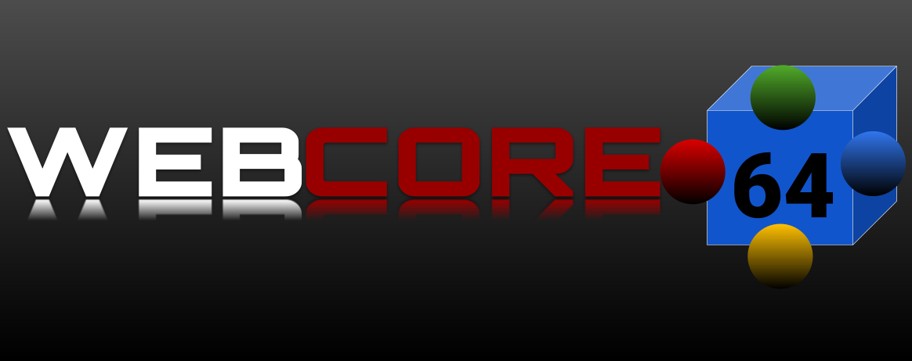

# 🚀 Webcore 64


**Webcore 64** is a high-performance, browser-based Nintendo 64 emulator library specifically optimized for **ChromeOS** and low-power hardware. It features a searchable database of the entire N64 library and custom configurations to fix common emulation bugs.

## ✨ Features
- **Chromebook Optimized:** Pre-configured with the `Rice` video plugin to eliminate audio lag and stuttering.
- **Fixed Controls:** Keyboard inputs are mapped to the N64 **Analog Stick** (WASD) so character movement works by default.
- **Graphical Fixes:** Enabled frame-buffer emulation to remove "character lines" and polygon seams on 3D models.
- **Massive Library:** Searchable interface designed to handle 388+ titles instantly.

## 🎮 Controls


| N64 Command | Keyboard Key |
| :--- | :--- |
| **Move (Analog Stick)** | `W` `A` `S` `D` |
| **A Button (Jump)** | `X` |
| **B Button (Attack)** | `Z` |
| **Z Trigger (Crouch)** | `Space` |
| **Start** | `Enter` |
| **C-Buttons (Camera)** | `I` `J` `K` `L` |
| **L / R Shoulders** | `Q` / `E` |

## 📁 Project Structure
```text
Webcore-64/
├── .github/
│   └── workflows/
│       ├── node.js.yml
│       └── static.yml
├── assets/
│   ├── boxart/           # All 12+ game covers (.png)
│   ├── Logo-gradient.png
│   ├── Logo-plain.png
│   ├── banner.png
│   ├── logo.png
│   └── startup.mp3
├── data/                 # Rebuilt via NPM
│   ├── compression/      # zip/7z extraction logic
│   ├── cores/            # Core-specific metadata
│   ├── localization/     # Multi-language JSON files
│   ├── src/              # Core engine (emulator.js, storage.js, etc.)
│   ├── config.js
│   ├── emulator.css
│   ├── loader.js         # The script your player.html calls
│   ├── n64.js            # N64 specific core script
│   └── version.json
├── roms/                 # Your N64 game library (.zip)
│   ├── banjo_kazooie.zip
│   ├── goldeneye.zip
│   ├── paper_mario.zip
│   ├── sm64.zip
│   ├── smash_bros.zip
│   ├── starfox64.zip
│   └── wave_race_64.zip
├── .nojekyll             # Crucial: Tells GitHub to serve all folders
├── 404.html
├── LICENSE
├── README.md
├── games.json            # Connects titles to roms/ and assets/
├── index.html            # Main Library UI
├── package.json          # NPM configuration
├── player.html           # The emulator loader page
├── style.css             # Site styling
├── sw.js                 # Service worker for offline use
└── update.js             # Update logic

## Star History

<a href="https://www.star-history.com/?repos=EmulatorJS%2FEmulatorJS%2Cisiguzoflorence521-gif%2FWebcore-64&type=date&legend=top-left">
 <picture>
   <source media="(prefers-color-scheme: dark)" srcset="https://api.star-history.com/chart?repos=EmulatorJS/EmulatorJS%2Cisiguzoflorence521-gif/Webcore-64&type=date&theme=dark&legend=top-left" />
   <source media="(prefers-color-scheme: light)" srcset="https://api.star-history.com/chart?repos=EmulatorJS/EmulatorJS%2Cisiguzoflorence521-gif/Webcore-64&type=date&legend=top-left" />
   
 </picture>
</a>
