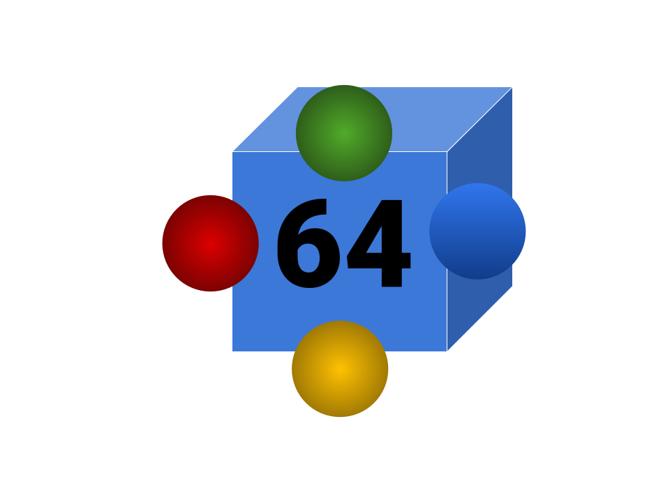

# 🚀 Webcore 64


**Webcore 64** is a high-performance, browser-based Nintendo 64 emulator library specifically optimized for **ChromeOS** and low-power hardware. It features a searchable database of the entire N64 library and custom configurations to fix common emulation bugs.

## ✨ Features
- **Chromebook Optimized:** Pre-configured with the `Rice` video plugin to eliminate audio lag and stuttering.
- **Fixed Controls:** Keyboard inputs are mapped to the N64 **Analog Stick** (WASD) so character movement works by default.
- **Graphical Fixes:** Enabled frame-buffer emulation to remove "character lines" and polygon seams on 3D models.
- **Massive Library:** Searchable interface designed to handle 388+ titles instantly.

## 🎮 Controls


| N64 Command | Keyboard Key |
| :--- | :--- |
| **Move (Analog Stick)** | `W` `A` `S` `D` |
| **A Button (Jump)** | `X` |
| **B Button (Attack)** | `Z` |
| **Z Trigger (Crouch)** | `Space` |
| **Start** | `Enter` |
| **C-Buttons (Camera)** | `I` `J` `K` `L` |
| **L / R Shoulders** | `Q` / `E` |

## 📁 Project Structure
```text
Webcore-64/
│
├── .github/
│   └── workflows/
│       ├── node.js.yml
│       └── static.yml
│
├── assets/
│   ├── logo.png
│   └── boxart/
│       ├── banjo_kazooie.png
│       ├── banjo_tooie.png
│       ├── goldeneye.png
│       ├── megaman64.png
│       ├── paper_mario.png
│       ├── perfect_dark.png
│       ├── sm64.png
│       ├── smash_bros.png
│       ├── starfox64.png
│       ├── wave_race_64.png
│       ├── zelda_mm.png
│       └── zelda_oot.png
│
├── data/
│   ├── emu-css.css
│   ├── loader.js
│   ├── n64.js
│   └── n64.wasm
│
├── roms/
│   ├── banjo_kazooie.zip
│   ├── paper_mario.zip        <-- Added
│   ├── sm64.zip
│   ├── smash_bros.zip
│   ├── starfox64.zip
│   └── wave_race_64.zip       <-- Added
│
├── .nojekyll
├── 404.html
├── README.md
│
├── config.js
├── games.json
├── index.html
├── player.html
├── style.css
│
├── sw.js
└── update.js
